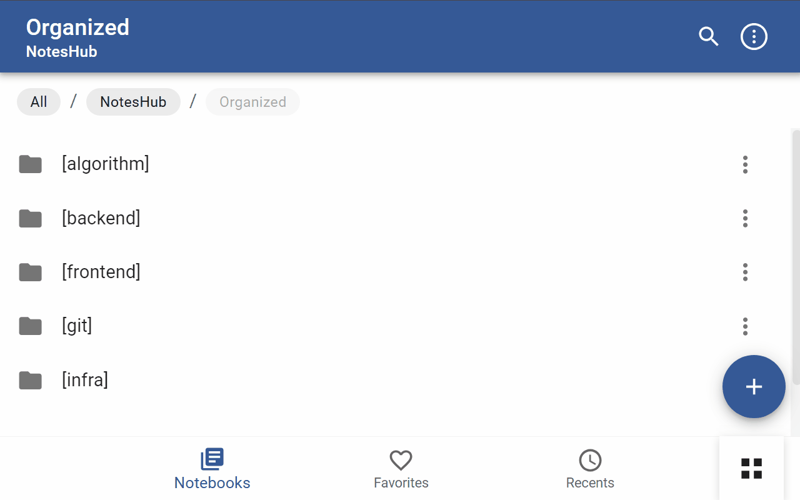

# NotesHub View Switcher

A Chrome extension that lets you freely switch between different view modes in NotesHub.

[한국어](README_KR.md)

## Key Features

- Floating view toggle button in bottom right
- Easy switching between list and grid views
- Keyboard shortcuts (Mac: ⌥+V, Windows: Alt+V)
- Auto-saves and restores view preference
- Works with dynamically loaded content
- Supports PWA shortcuts

## Grid View Features

- Clean grid layout
- Intuitive file/folder icons
- Smooth hover interactions
- Responsive design that adapts to screen size
- Consistent card sizing for organized UI

## Demo

## Installation

### From Chrome Web Store

1. Search for 'NotesHub View Switcher' in the [Chrome Web Store](https://chrome.google.com/webstore/category/extensions)
2. Click 'Add to Chrome'

### Manual Installation (Developer Mode)

1. Download files from this repository to a new folder
2. Open `chrome://extensions` in Chrome browser
3. Enable "Developer mode" in top right
4. Click "Load unpacked"
5. Select the downloaded folder

## Usage

When you visit NotesHub, a view toggle button appears in the bottom right corner.
Click the button or use keyboard shortcuts to switch between list and grid views.

### Keyboard Shortcuts

- Mac: `⌥` + `V`
- Windows/Linux: `Alt` + `V`

## Browser Support

- Chrome
- Chromium-based browsers (Edge, Brave, etc.)
- PWA (Progressive Web App)

## Privacy

This extension does not collect or transmit any user data.
View preferences are stored only in your browser's local storage.

## Contributing

Bug reports, feature suggestions, and pull requests are welcome.

## License

MIT License

## Developer Info

- GitHub: [BongSangKim](https://github.com/BongSangKim)
